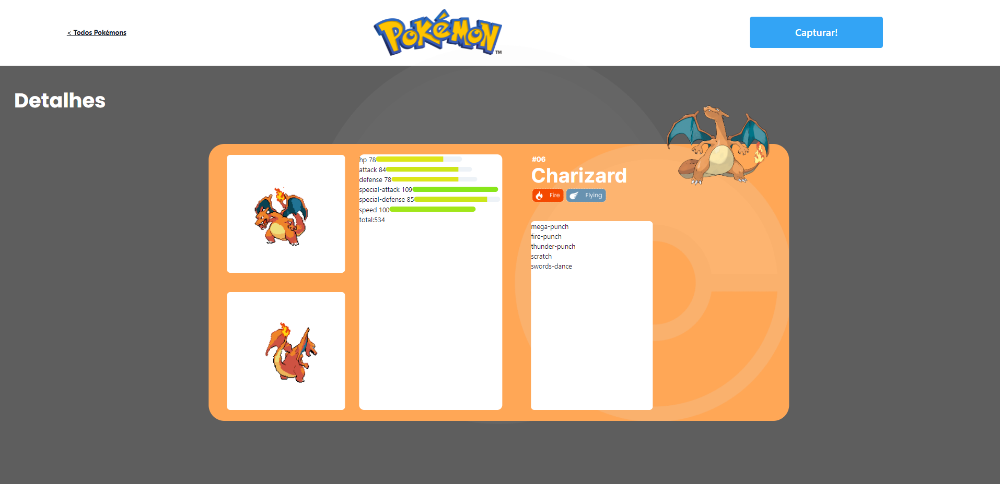
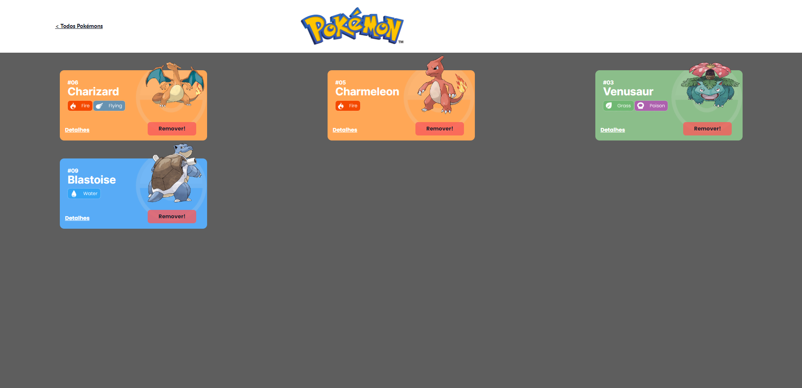

# Projeto Pokédex API


Projeto reproduzindo uma Pokédex!

## Índice
- <a 
href="#-"> Funcionalidades do Projeto</a>
- <a href="#layout">Layout</a>
- <a href="#layout">Como rodar o projeto?</a>
- <a href="#layout">Tecnologias utilizadas</a>
- <a href="#layout">Pessoa Autora</a>

## Funcionalidades do Projeto

- [x] Listagem de Pokémons
- [x] Visualizar os detalhes do Pokémon
- [x] Adicionar o Pokémon desejado a Pokédex
- [x] Acessar a página da Pokédex e visualizar seus pokémons
- [x] Remover os Pokémons da Pokédex

## Layout





## Como rodar este projeto?

```bash
# Clone este repositório
$ git clone linkrepo

# Acesse a pasta do projeto no seu terminal 
$cd projeto-react-apis

# Instale as dependências
$ npm install

# Execute a aplicação
$ npm run start

# A aplicação será iniciada na porta 3000,
acesse pelo seu navegador: https://localhost:3000
```

## Tecnologias Utilizadas
1. [React](https://pt-br.reactjs.org/)
2. [React Router](https://reactrouter.com/)
3. [Chakra](https://chakra-ui.com/)
4. [API](API)

## Pessoa autora

- [Meu linkedin](https://www.linkedin.com/in/jonath%C3%A3-santos-759041278/)